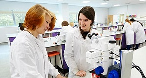
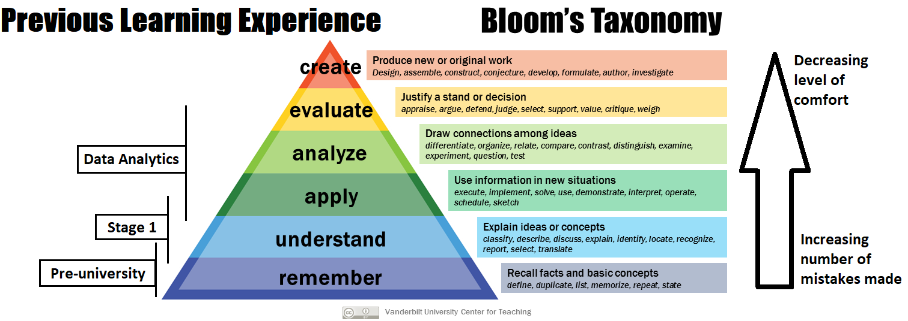
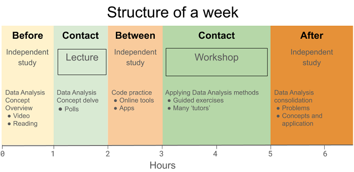
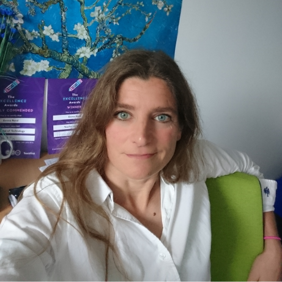

```{r setup, include=FALSE}
knitr::opts_chunk$set(echo = FALSE,
                      warning = FALSE,
                      message = FALSE,
                      fig.show = "asis")
```

```{r pkg}
# pkg
library(tidyverse)
library(likert)
library(psych)
library(gridExtra)
library(kableExtra)
library(jpeg)
library(png)
library(grid)
```

<!-- info -->
<!-- Submit to phil.robinson-self@york.ac.uk with any accompanying photos or illustrations -->
<!-- 650w one page, or 1300w two page. Let Phil know asap -->
<!-- Tone: intelligent but general reader  -->
<!-- References: Harvard author-date style (see https://www.york.ac.uk/integrity/harvard.html for details). -->
<!-- Photographs or other images: copyright free and have permission for use. The editorial team will also source appropriate images in line with magazine content. -->


<!-- Checklist -->
<!-- Article length: is your article 650 or 1300 words in length? -->
<!-- Titles, byline, subheadings? -->
<!-- In-text citations:Harvard system? (Author name, year) -->
<!-- References: Harvard system, alphabetical -->
<!-- Author details: name, biography, photo -->

<!-- Past magazines can be found on the website: http://yorkforum.org/forum-magazine/. -->

# A blended-learning design for data skills modules in Biology

## Overcoming the challenges of teaching data analysis and programming to early career and sometimes wary biologists. Emma Rand

### Introduction
The analysis and presentation of data are core learning outcomes of Biology-led undergraduate programmes and a requirement for conducting biological research. However, the combination of a stage one biology student’s perception of their subject and their previous learning experiences can lead them to be wary of data analysis and coding. Furthermore, the cognitive processes required to learn these skills are towards the apex of Bloom's taxonomy and this is in contrast to those often required to perform well in pre-university and stage 1 assessments. This article discusses some challenges in teaching data skills to students for whom it is taught as a skill to do the research in their chosen field, and describes a blended learning approach to meet some of those challenges.

### Data Skills as a core part of the Biologist’s training 
Underlying all biological discoveries are data! The ability to generate reliable measures of biological phenomena then analyse them and communicate the results, is essential for a biologist. This has long been the case [see, for example: @RSS_1947; @Finney_1968], but more recently an explosion of large-scale and complex biological data has made the acquisition of data skills even more crucial [@nationalnrc]. This is reflected in the Programme Learning Outcomes for Biology-led programmes (Table \@ref(tab:plo-tab)). 


```{r ploimport}
plo <- read.table("BSc_PLO.txt", header = FALSE, sep = "\t")
```

```{r plo-tab,}
plo %>% 
  knitr::kable(caption = "BSc Biology Programme Learning Outcomes.",
               escape = FALSE,
               col.names = "  ") %>%
  kable_styling() %>% 
  kable_styling(bootstrap_options = c("striped", "condensed"),
                font_size = 11) %>%
  column_spec(1, width = "15cm")

# PLO for BSc and MBiol in Biomedical Science, Biotechnology & Microbiology, Ecology, Genetics and Molecular Cell Biology have a similiar emphasis on data skills.

``` 


Opportunities to develop and apply these skills are embedded across entire programmes but we also include modules with a specific focus on data analytics. One of these is a stage one module called "Laboratory and Professional Skills for the Bioscientist" in which a term, carrying 10 credits, is devoted to Data Analysis in R. There are 25 hours of contact time (nine one-hour lectures and eight two-hour workshops) and 75 hours of independent study and assessment. The module is taken by 250 - 280 stage 1 students.

### How do the challenges arise?

A stage 1 biology student may expect to spend the most of their time in the laboratory or the field and our Admissions pages, for example, feature students working in these environments (Figure \@ref(fig:admissions-fig)). 

```{r admissions-fig, fig.cap = "Image taken from Biology Undergraduate Admissions pages", out.width = "50%", fig.align='center', fig.pos = 'h'}
 
```


The importance placed on data handling and analysis in a biology degree can therefore come as surprise and not a welcome one! These subjects are recognised as among the more difficult to teach [e.g., @Du_Boulay1986], require more and harder work from the student and may be relatively unpopular [e.g., @Uttl2017-tk]. At the start of the first lecture of Data Analysis in R, many students do not expect to enjoy it with 70% disagreeing with the statement "I will enjoy data analysis." in 2018 (Figure \@ref(fig:enjoy2018-fig)).


```{r enjoy2018-create}
enjoy2018 <- data.frame(Y2018 = rep(c("Definitely\nagree",
                                      "Probably\nagree",
                                      "Neutral",
                                      "Probably\ndisagree",
                                      "Definitely\ndisagree"), 
                                    times = c(2, 9, 13, 43, 12)))
enjoy2018 <- enjoy2018 %>% 
  mutate(Y2018 = factor(Y2018, levels = c("Definitely\ndisagree",
                                          "Probably\ndisagree",
                                          "Neutral",
                                          "Probably\nagree",
                                          "Definitely\nagree")))
```

```{r enjoy2018-fig, fig.height = 2, fig.cap="Expectations of Stage 1 Biologists about Data Analysis in 2018: Responses to the question '**I will enjoy data analysis.**' given as the first slide of contact time slot.", , fig.pos = 'h'}
lik <- likert(enjoy2018)
plot(lik,
     legend.position = "top",
     legend = "",
     text.size = 4,
     low.color = "lightblue")

```

The education to which they have primarily been exposed is towards the foundational levels of the revised Bloom’s taxonomy of learning [@revisedtax2001]  whereas the acquisition of data analytic skills occurs at the levels of "applying", "analysing" and "evaluating" (left side of Figure \@ref(fig:blooms-fig)). Memorising does little to help a student analyse and represent their data. Every situation is new and they must analyse it, recognise how to apply complex skills and evaluate the results.  


```{r blooms-fig, out.width = "100%", fig.cap = "An annotated Revised Bloom's taxonomy adapted  from Vanderbilt University Center for Teaching. Data analysis typically requires learning over a wider range of levels with a greater number of mistakes than a stage 1 student has previously experienced.", fig.align='center', fig.pos = 'h'}



```


Associated with increasing levels of Bloom’s taxonomy is an increase in the number of mistakes made (right side of Figure \@ref(fig:blooms-fig)). Research is characterised by repeated rounds of 'trial and error' with successes being infrequent. This is in contrast to the one-time correction of one's factual knowledge, and tends to be more uncomfortable. One way to characterise Bloom's taxonomy is that it is process of becoming more comfortable with failure as a learning opportunity.

### What’s required to meet the challenges?
Learning to programme requires a lot of practice. Novice programmers see many aspects of programming syntax such as the use of brackets, quotes, commas and spaces, as arbitrary and need substantial practice and exposure to start to see code as experienced practitioners do [@sorva2018]. This activity is well-suited to directed independent learning but it can be difficult to motivate students to do sufficient amounts [@a1996teaching; @Carey_et_al_2018]. Using contact time to partially achieve this can increase engagement but does not maximise the value of that contact time which is better spent engaging with students to develop their conceptual understanding and strengthen the staff-student partnership.

### Blended learning solutions
Flipped-learning is employed throughout Data Analysis in R to help students meet the challenge of acquiring data skills. The module has a repeated weekly structure comprising periods of guided independent study interleaved with active and problem-based learning placed within contact time. These are followed up with formative work (Figure \@ref(fig:week-fig)).


```{r week-fig, out.width = "100%", fig.cap = "The structure of a 'Data Analysis in R' week. There are two periods of contact: a lecture covering statistical concepts and a workshop putting those concepts in to practice in R. The contact periods are interleaved with guided independent study which focusses on the conceptual overview, code practice and the independent application of both to complex problems.", fig.align='center', fig.pos = 'h'}



```


Independent study issued before the first contact point gives an overview of the statistical concepts covered during that week. The exercises are designed to take an hour or less and vary in format. They include videos, accessible articles and material from online data analysis books. The lecture provides a deeper coverage of the topic concepts and an introduction to code that will be used in the workshop. An audience response system is used to facilitate active learning which has been shown to increase student performance in STEM subjects [@Freeman8410]. Between contact points, the independent study is focused on code 'mechanics' using an online tool, which gamifies code practice (https://www.datacamp.com/home) and allows students to practice the R language syntax without having to simultaneously consider statistical concepts. The second period of weekly contact consists of a two-hour workshop of structured data analysis problems which require students to apply their understanding of statistical concepts using R to generate analyses of biological data in forms suitable for a report. The problems are broken down into the steps required to take the problem scenario and data through to conclusion and reporting. This activity is well supported with graduate demonstrators. Independent study exercises provided following the workshop give scenarios with data for which students design an appropriate analysis workflow.


In 2019, I introduced a discrete unit of independent study designed to be carried out before the start of the module. This was specifically designed to train students in R language syntax. The aim was to make less steep the learning curve involved in acquiring data analytic skills by including activity that did not require the simultaneous assimilation of both statistical and coding concepts. This one, relatively short piece of work, significantly reduced the level of fear expressed about learning R (Figure \@ref(fig:comp-fig)). Whilst students' expectations of data analysis in 2019 were unchanged from those in 2018, the percentage of students terrified of, or worried about, R dropped from 67% to 26% and that of students unconcerned or excited about R rose from 23% to 49%
Since fear of a subject can influence an individual's capacity to initiate and complete tasks [@Onwuegbuzie20014] we might predict an increase in learning achieved. This will be the subject of a future analysis of attainment.

 
```{r enjoy2019-create}
enjoy2019 <- data.frame(Y2019 = rep(c("Definitely\nagree",
                                      "Probably\nagree",
                                      "Neutral",
                                      "Probably\ndisagree",
                                      "Definitely\ndisagree"), 
                                    times = c(5, 20, 24, 49, 41)))
enjoy2019 <- enjoy2019 %>% 
  mutate(Y2019 = factor(Y2019, levels = c("Definitely\ndisagree",
                                          "Probably\ndisagree",
                                          "Neutral",
                                          "Probably\nagree",
                                          "Definitely\nagree")))
```

```{r enjoy2019-figure}
lik <- likert(enjoy2019)
plota <- plot(lik,
              legend.position = "top",
              legend = "",
              text.size = 4,
              low.color = "lightblue")

```


```{r r-feel-create}

r_feel <- data.frame(Y2018 = rep(c("Excited",
                                      "Seems ok",
                                      "Undecided",
                                      "A bit\nworried",
                                      "Terrified"), 
                                times = c(4, 19, 10, 34, 33)),
                     Y2019 = rep(c("Excited",
                                      "Seems ok",
                                      "Undecided",
                                      "A bit\nworried",
                                      "Terrified"), 
                                times = c(12, 37, 25, 18, 8)))
r_feel <- r_feel %>% 
  mutate(Y2019 = factor(Y2019, levels = c("Terrified",
                                          "A bit\nworried",
                                          "Undecided",
                                          "Seems ok",
                                          "Excited")),
         Y2018 = factor(Y2018, levels = c("Terrified",
                                          "A bit\nworried",
                                          "Undecided",
                                          "Seems ok",
                                          "Excited")))
```

```{r feel-figure}
lik <- likert(r_feel)
plotb <- plot(lik,
              legend.position = "top",
              legend = "",
              text.size = 4,
              low.color = "lightpink",
              high.col = "yellow")
```

```{r comp-fig, fig.cap="Expectations of Stage 1 Biologists about of Data Analysis in 2019. Responses to the question '**I will enjoy data analysis**' follow the same pattern as in 2018 (upper panel). However, when asked '**How do you feel about R?**' anxiety was significantly reduced following the introduction of an independent study activity prior to any contact time (lower panel).", , fig.pos = 'h'}

grid.arrange(plota, plotb)


```


In summary, module teaching comprises online, independent and face-to-face learning activities in which the independent study is guided and fully integrated by interleaving it with contact time. 


## Supporting Material

### Biography
Emma Rand is a Teaching & Scholarship lecturer in the department of Biology, the University of York. She specialises in experimental design and reproducible data science from pre-processing and exploration to statistical analysis and visualisation. She was an invited tutor at useR!2019, the International R Conference, and a trainer for the Royal Society of Biology and The Biochemical Society. She is twice the winner of YUSU’s Teacher of the Year Excellence Award

Email: emma.rand@york.ac.uk




